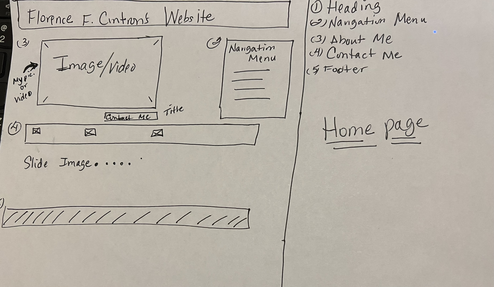
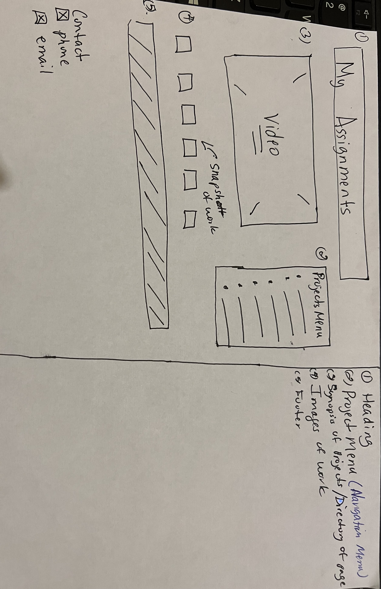
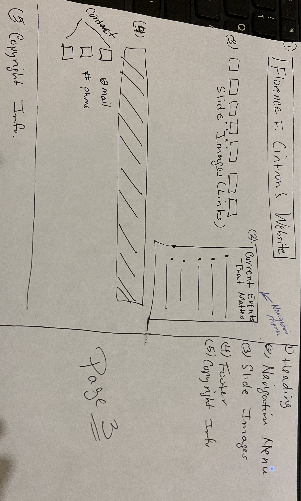

# Florence F. Cintron's Website Project
A Portfolio showcasing my work

## wireframes 

Here are a few wireframes to show how the layout of the website might possibly look like. 

 
My header-will include my name and navigation menu

The navigation menu-will link to other information on the website

Main content-will provide a brief synopsis and guide on how to navigate the assignments found on the page

The footer- provides the copyright information and various ways to contact me

My header-will inform the user that all assignments will be found on page

The Project Menu- will provide links to all my projects 

Main content-is a video that will provide a brief synopsis on projects found

Content- slideshow of snapshots of work 

The Footer- provides contact information

 
My Heading- will include my name 

The Navigation menu- will provide links to current events articles

Main content- provides images and links that reflects my philosophy

The Footer- provides contact and copyright information